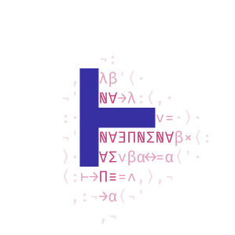

<p align="center">
  
</p>

<h1 align="center">lode</h1>

<p align="center">
  <em>A coding agent in Lean 4 that writes typed functions and reactive graphs for lun, in a repository it shares with you.</em>
</p>

<p align="center">
  <a href="https://github.com/typednotes/lode/actions/workflows/lean_action_ci.yml"></a>
  <a href="https://github.com/typednotes/lode/actions/workflows/docker-publish.yml"></a>
  <a href="https://github.com/typednotes/lode/pkgs/container/lode"></a>
  <a href="https://github.com/typednotes/lode/tags"></a>
  <a href="https://lean-lang.org/"></a>
  <a href="https://github.com/typednotes/linen"></a>
  <a href="https://github.com/typednotes/liaison"></a>
  <a href="LICENSE"></a>
</p>

---

`lode` is the coding agent of [typednotes](https://github.com/typednotes/typednotes):
an HTTP service that runs model-driven sessions over a branch of a git
repository and writes the Lean 4 projects [`lun`](https://github.com/typednotes/lun)
builds and serves — modules implementing **functions** (each under a declared
signature ending in linen's `Eff`), **graphs** wiring them, and the `lun.json`
declaring both. A session is done when lun builds the published commit and the
functions and graphs answer as intended.

lode holds no third-party credential: it reaches the repository (GitHub,
GitLab) and the model (Anthropic, Mistral, OpenAI or any OpenAI-compatible
endpoint) through [`liaison`](https://github.com/typednotes/liaison), with
warrants the typednotes app mints for each connection, in liaison's own wire
format (`Liaison.Wire`). It is built on
[`linen`](https://github.com/typednotes/linen) and runs as a container.

```
 user / typednotes app ──HTTP──▶ lode ──(warrant)──▶ liaison ──▶ GitHub / GitLab              open, publish
                                  │    ──(warrant)──▶ liaison ──▶ Anthropic / Mistral / OpenAI…  the model
                                  └──────────────────▶ lun  build the published commit, call functions and graphs
```

## Table of contents

- [Features](#features)
- [Quick start](#quick-start)
- [How a session goes](#how-a-session-goes)
- [Tools](#tools)
- [HTTP API](#http-api)
- [Configuration](#configuration)
- [Docker](#docker)
- [Design](#design)
- [Project status](#project-status)
- [License](#license)

## Features

- **Writes for lun** — the system prompt carries lun's contract (functions,
  the allowed effects, graphs, `lun.json`), and the tools close the loop: `check`
  (`lake build` diagnostics), `publish`, `lun_build` (lun's diagnostics,
  attributed to each function and graph), `lun_call`.
- **A shared repository** — one branch of a GitHub or GitLab repository,
  opened and published through liaison (blobs → tree → commit →
  fast-forward on GitHub, a commit with actions on GitLab); never a force
  push, so someone else's work is never overwritten.
- **Any model** — Anthropic's Messages API and OpenAI's Chat Completions
  behind one provider-independent message model, through liaison (metered
  per call) or, for development, directly.
- **Steerable** — a message sent while the agent works reaches it between two
  steps; runs can be aborted, followed by long-polling, and resumed after a
  restart.
- **Bounded** — the loop is total (structural in its fuel: at most
  `LODE_MAX_STEPS` model calls per run); tool arguments are parsed into typed
  values before anything runs; paths never leave the checkout (linen's
  `FileSystem` capability, symbolic links resolved); lode's own secrets are
  scrubbed from what the model runs.
- **Long sessions** — compaction by summary when the context fills up; an
  append-only log keeps everything.
- **Two agents** — `build` does everything; `plan` reads, checks and proposes.

## Quick start

### Build

```sh
lake build
```

### Test

```sh
lake test          # unit tests (#guard): every parser and pure rule
test/e2e.sh                   # a real agent loop (scripted model) over a real repository
test/liaison.sh               # GitHub, GitLab and the model through a mock liaison
test/lun.sh ../lun ../linen   # with a real lun (>= 0.2.0) and a linen checkout
```

### Run

```sh
LODE_WORKDIR=/tmp/lode LODE_TOKEN=... \
  LODE_LIAISON_URL=http://localhost:8081 \
  LODE_LUN_URL=http://localhost:8082 LODE_LUN_TOKEN=... \
  lake exe lode
```

Needs `git`, `tar`, `bash`, `elan`/`lake` and linen's native build
dependencies on the `PATH` (see the `Dockerfile`).

Then open a session and give it a task:

```sh
curl -s -X POST localhost:8080/v0/sessions -H "Authorization: Bearer $LODE_TOKEN" -d '{
  "source": {"url": "https://github.com/acme/sheets", "branch": "main", "path": "lean",
             "credentials": {"warrant": {…}, "account": "{user_id}/{connection_id}"}},
  "model": {"name": "claude-sonnet-4-5", "credentials": {"warrant": {…}, "account": "…", "cost": 10}},
  "message": "Write a function that converts EUR to USD, and a graph summing two converted amounts."
}'
curl -s "localhost:8080/v0/sessions/$ID/messages?after=0&wait=30" -H "Authorization: Bearer $LODE_TOKEN"
```

## How a session goes

```
POST /v0/sessions                  open a branch of a repository
POST …/messages {"text"}           a run: model → tools → model … until it answers without tool calls
                                   (a message during a run steers it)
GET  …/messages?after=n&wait=30    follow the log
GET  …/diff                        what is not published yet
POST …/abort                       stop
```

In a run, the model typically explores the repository; writes modules;
`check`s until `lake build` is clean; writes `lun.json`; `publish`es one
commit on the shared branch; `lun_build`s the published commit and fixes what
lun reports per function and graph; `lun_call`s the result; and ends with a summary
naming the commit, the lun build and the services.

## Tools

| Tool | |
|---|---|
| `read` | a text file with line numbers (≤ 2000 lines per call, `offset`/`limit`) |
| `ls` | files under a directory, git-aware (no `.git`, `.lake`, ignored files) |
| `grep` | `git grep -n -E` over tracked and untracked files |
| `write` | create or overwrite a file |
| `edit` | replace exact text, which must occur once (or `all`) |
| `bash` | a non-interactive command in the project directory (timeout ≤ 1800 s; last 2000 lines / 50 kB) |
| `todo` | the model's task list (visible in the session's status) |
| `check` | `lake build` (optionally of some targets): its errors and warnings |
| `publish` | commit every change and push it to the branch |
| `lun_build` | have lun build the published commit with `lun.json`; wait; report state, diagnostics, functions, graphs |
| `lun_call` | call a function, or run a graph once, of the latest ready build |

Paths never leave the checkout; `.git` and `.lake` cannot be written. The
`plan` agent has `read`, `ls`, `grep`, `todo`, `check` and `lun_call`.

### `lun.json`

In the project directory, written and published by the model with the code:

```json
{
  "open": ["MyProject"],
  "functions": [{"name": "double", "module": "MyProject.Math", "function": "MyProject.double",
             "signature": "Nat → Eff [] Nat"}],
  "graphs": [{"name": "main", "program": "do\n  let x ← input \"x\" Nat\n  double x"}]
}
```

lode adds the source (repository, branch, published commit, project path,
and the repository warrant) and submits it to lun. The same file lets anyone
rebuild the project from the repository alone.

## HTTP API

| Route | |
|---|---|
| `GET /_health` | `200` (empty body) |
| `POST /v0/sessions` | create a session (below): opens the workspace; `201` with its status; starts a run if `message` is given |
| `GET /v0/sessions` | every session's status, newest first |
| `GET /v0/sessions/{id}` | status: `state` (`idle`/`running`), `steps`, `queued`, `workspace.remoteHead`, `lastBuild`, `todos`, `usage`, `credentials` (which are held), `error` |
| `DELETE /v0/sessions/{id}` | delete an idle session and its workspace |
| `POST /v0/sessions/{id}/messages` | `{"text", "credentials"?, "agent"?}` → `202 {"queued", "session"}` |
| `GET /v0/sessions/{id}/messages?after=n&wait=s` | `{"entries": [...], "next", "running"}`: the log from entry `n`; `wait` (≤ 60 s) holds the request until something new happens |
| `POST /v0/sessions/{id}/abort` | `202`, or `409` if no run is going |
| `PUT /v0/sessions/{id}/credentials` | `{"repo"?, "model"?, "lun"?}`: fresh warrants |
| `GET /v0/sessions/{id}/diff` | unpublished changes, `text/plain` |

With `LODE_TOKEN` set, every route but `/_health` needs
`Authorization: Bearer {token}`. Errors are `{"error": "…"}`.

### Creating a session

```jsonc
{
  "source": {
    "url": "https://github.com/owner/repo",   // github.com, gitlab.com, or any https host (public, read-only)
    "branch": "main",                          // must exist; lode commits on it
    "path": "lean",                            // optional: the project directory
    "credentials": { "warrant": { … }, "account": "{user_id}/{connection_id}" }  // github / gitlab connection
  },
  "model": {                                   // optional when the server has a default model
    "name": "claude-sonnet-4-5",
    "credentials": { "warrant": { … }, "account": "…", "cost": 10 },  // anthropic / mistral / openai / openai-compatible
    "api": "anthropic",                        // implied by the connection; "openai" for Chat Completions
    "baseUrl": "https://api.anthropic.com/v1", // implied for anthropic, mistral, openai
    "maxTokens": 8192, "contextWindow": 200000
  },
  "lun": { "credentials": { … } },             // optional: what lun reads the repository with (default: source's)
  "agent": "build",                            // or "plan"
  "message": "Write a function that …"             // optional: start at once
}
```

`cost` is the credits liaison holds for each model call. Warrants expire
within minutes (the app mints them for 300 s): send fresh ones with each
message, or with `PUT …/credentials`. They are kept in memory only.

### The log

One JSON object per entry, each with `index`, `type` and `time` (Unix ms):
`user` (`text`), `assistant` (`text`, `calls`: `[{id, name, arguments}]`,
`usage`, `stop`, `model`), `tool_results` (`results`: `[{id, name, content,
isError}]`), `compaction` (`summary`, `firstKept`), `event` (`kind`:
`run_started`, `run_finished`, `aborted`, `error`, `out_of_fuel`,
`interrupted`; `detail`).

## Configuration

| Variable | Default | |
|---|---|---|
| `LODE_PORT` | `8080` | |
| `LODE_WORKDIR` | `/var/lib/lode` | sessions: `sessions/{id}/{session.json,log.jsonl,checkout/}` |
| `LODE_TOKEN` | — | bearer token for the API; unset means unauthenticated (logged loudly) |
| `LODE_LIAISON_URL` | — | liaison, for GitHub/GitLab repositories and models with credentials |
| `LODE_LUN_URL`, `LODE_LUN_TOKEN` | — | lun, for `lun_build` / `lun_call` |
| `LODE_LUN_BUILD_TIMEOUT` / `LODE_LUN_CALL_TIMEOUT` | `3600` / `120` | seconds |
| `LODE_MODEL_API`, `LODE_MODEL_NAME`, `LODE_MODEL_BASE_URL`, `LODE_MODEL_MAX_TOKENS`, `LODE_MODEL_CONTEXT_WINDOW` | — | the server's default model |
| `LODE_MODEL_API_KEY` | — | development: a key sent directly to the default model's endpoint (and only there) |
| `LODE_MAX_STEPS` | `200` | model calls per run |
| `LODE_MODEL_TIMEOUT` / `LODE_GIT_TIMEOUT` / `LODE_CHECK_TIMEOUT` | `600` / `600` / `1800` | seconds |
| `LODE_PACKAGE_CACHE` | — | pre-built linen checkouts, `{cache}/linen/{rev}` |
| `LODE_LINEN_REV` / `LODE_TOOLCHAIN` | `v1.9.0` / `leanprover/lean4:v4.34.0` | what new projects are told to use |
| `LODE_ALLOW_LOCAL` | — | `1`: `file://` repositories and the `scripted` model. Tests only |

## Docker

Images are published to `ghcr.io/typednotes/lode` — `edge` from `main`, and
`latest`, `X.Y.Z` and `X.Y` from release tags. The image carries the Lean
toolchain and linen (`LINEN_REF`, default `v1.9.0`) pre-built in the package
cache, so a workspace locked to that revision does not rebuild linen.

Pick the tag that matches your lun: `0.1.x` speaks lun < 0.2.0 (cells and
DAGs); `main` (`edge`, and releases after 0.1) speaks lun ≥ 0.2.0 (functions
and graphs).

### Starting a container from the registry

The package is public: no `docker login` is needed.

```sh
docker pull ghcr.io/typednotes/lode:edge
```

lode is an internal service: typednotes calls it, and it calls liaison and
lun. Put the four on one network and address them by container name; lode
needs no published port for typednotes to reach it at `http://lode:8080`.

```sh
docker network create typednotes            # once; liaison and lun join it too
docker volume create lode                   # sessions, logs and checkouts
LODE_TOKEN="$(openssl rand -hex 32)"        # typednotes needs the same value

docker run -d --name lode --restart unless-stopped \
  --network typednotes \
  -v lode:/var/lib/lode \
  -e LODE_TOKEN="$LODE_TOKEN" \
  -e LODE_LIAISON_URL=http://liaison:8080 \
  -e LODE_LUN_URL=http://lun:8080 -e LODE_LUN_TOKEN=... \
  ghcr.io/typednotes/lode:edge
```

Give typednotes the same `LODE_TOKEN` (it sends `Authorization: Bearer …`).
The other variables are in [Configuration](#configuration); the image already
sets `LODE_WORKDIR`, `LODE_PACKAGE_CACHE` and `LODE_LINEN_REV`, so leave them
alone.

Check it:

```sh
docker logs lode                            # "lode listening on :8080", and warnings for what is unset
docker run --rm --network typednotes curlimages/curl -fsS http://lode:8080/_health && echo ok
```

To reach it from the host too (development), publish on loopback only:
`-p 127.0.0.1:8080:8080`.

Notes:

- **State.** Sessions live in `/var/lib/lode`. A named volume, as above, gets
  the image's ownership; a bind mount must be writable by uid `10001`
  (`chown 10001 /srv/lode`). Credentials are never written there: after a
  restart, sessions resume once typednotes sends fresh warrants.
- **Outbound network.** Model and GitHub/GitLab API calls go through liaison,
  but the container itself still needs egress to `github.com` and
  `codeload.github.com` (GitHub tarball downloads, `git`/`lake` fetching a
  project's dependencies) and to Lean's release servers if a project asks for
  another toolchain. The image carries the system CA bundle for those.
- **One lode per trust domain.** `bash` runs whatever the model asks inside the
  container, so the container is the isolation boundary: give it no
  credentials of its own and do not share it across organisations (see
  [Project status](#project-status)).
- **Platform.** Images are `linux/amd64` only. On Apple Silicon add
  `--platform linux/amd64` (emulated, so `lake build` is slow), or build the
  image locally.
- `podman` takes the same commands.

Standalone, for trying lode without liaison (a public repository, read-only,
and a model key sent directly to the provider):

```sh
docker run --rm -p 127.0.0.1:8080:8080 -v lode:/var/lib/lode \
  -e LODE_TOKEN=dev \
  -e LODE_MODEL_NAME=claude-sonnet-4-5 -e LODE_MODEL_API_KEY="$ANTHROPIC_API_KEY" \
  ghcr.io/typednotes/lode:edge
```

### Building the image

To build the image locally:

```sh
docker build -t lode .
```

## Design

lode takes its shape from two agents that got it right:

- **From [pi](https://github.com/badlogic/pi-mono)**: a small core and a short
  system prompt (the model knows how to code; it needs its tools, its
  environment and its mission); a few sharp tools (`read`, `write`, `edit`,
  `bash`, plus read-only `ls`/`grep`); one provider-independent message model
  over several wire formats; a session as an append-only log; `AGENTS.md`
  context files; **steering**; output truncation limits; **compaction** by
  summary.
- **From [OpenCode](https://opencode.ai)**: a client/server split (the agent
  *is* an HTTP server with sessions and messages); **agents** with tool
  allowlists; a `todo` tool; compiler **diagnostics fed back after edits**
  (Lean itself as the language server); exact-string `edit`.

And from typednotes' agent design (`docs/services/agent.md`): a loop that is
**total by construction**, tool arguments **parsed into typed values** at the
boundary where the model's text becomes an action, and authority that is only
ever what the warrants carry.

lode reuses before it writes: JSON through derived `ToJson`/`FromJson`,
liaison's format through `Liaison.Wire`, and linen's URL encoding, dates,
commit ids, filesystem capabilities and middleware; Lake's own manifest
parser.

## Project status

`lode` is at **v0.1**: every path is exercised end to end — against a
scripted model and real repositories, a mock liaison for GitHub, GitLab and
Anthropic's format, and a real lun — but it has not yet been run against a
real model, so how reliably a model drives the workflow to a green lun build
is unmeasured. Warrants expire within minutes and lode cannot refresh them
(the caller sends fresh ones); it forwards warrants as given rather than
narrowing them; model calls are metered per call, not per token. See
[`AGENTS.md`](AGENTS.md) for the module layout and the full list of named gaps.

## License

Licensed under the [Apache License, Version 2.0](LICENSE).
