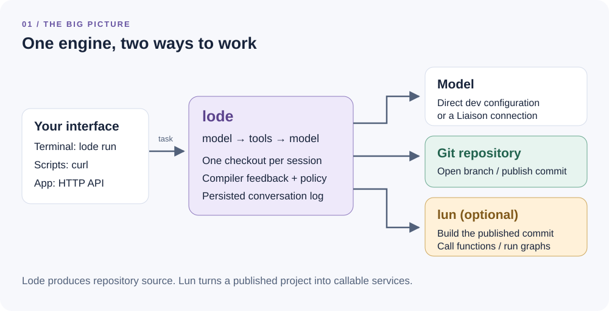
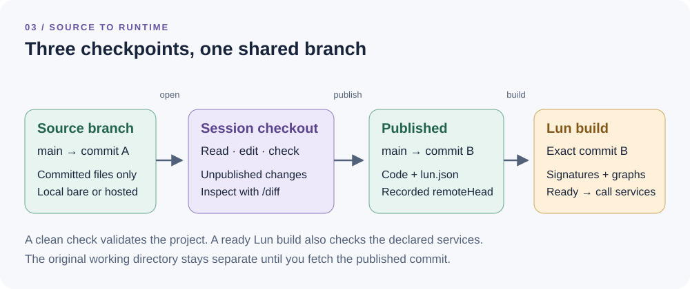
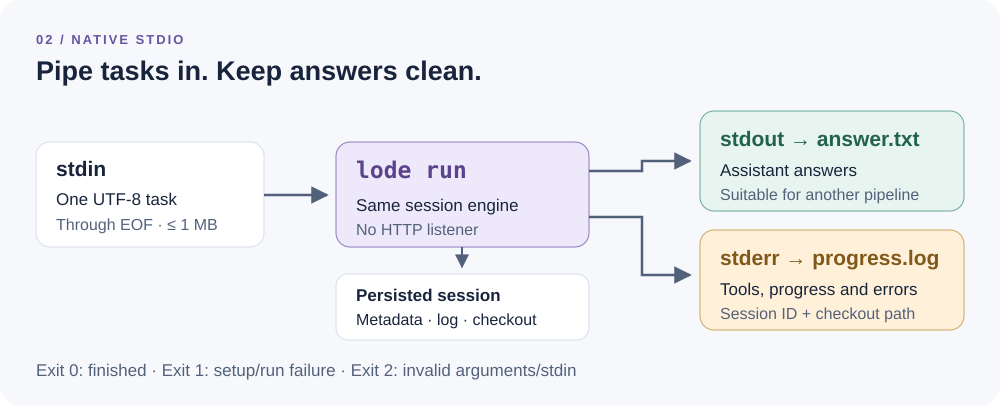
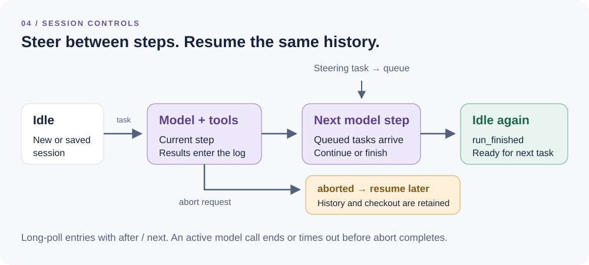
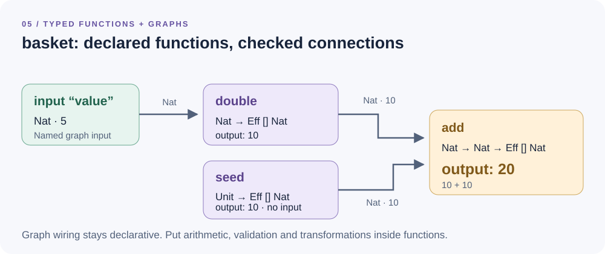

# The lode user guide

**From a task to checked Lean code, a Git commit, and typed services.**

Lode is a coding agent: give it a repository, a branch and a task. It reads
the project, edits files, receives compiler feedback, and can publish the
result. With Lun configured, it also builds and tries the functions and
graphs it wrote.

You can drive it from a terminal with **stdin/stdout/stderr**, from a script
with **curl**, or from the Typednotes app through the HTTP API.

This guide targets **Lode 0.5.0**, including the native CLI, caller-owned build
contracts, background checkout and bounded user questions. Older images do not
include every feature; publish the matching release before deployment. The [README](../README.md) records release and
dependency versions; the [local testing guide](local-testing.md) is a shorter
CLI/curl walkthrough.

## Contents

1. [The mental model](#1-the-mental-model)
2. [A first run without an API key](#2-a-first-run-without-an-api-key)
3. [Choose a real model](#3-choose-a-real-model)
4. [The CLI cookbook](#4-the-cli-cookbook)
5. [The curl cookbook](#5-the-curl-cookbook)
6. [Planning, steering and stopping](#6-planning-steering-and-stopping)
7. [Choose the tools a session can use](#7-choose-the-tools-a-session-can-use)
8. [Compiler feedback and Lean LSP](#8-compiler-feedback-and-lean-lsp)
9. [Write functions and graphs for Lun](#9-write-functions-and-graphs-for-lun)
10. [Keep caller-owned types fixed](#10-keep-caller-owned-types-fixed)
11. [Brokered repositories and models](#11-brokered-repositories-and-models)
12. [Background work and decisions](#12-background-work-and-decisions)
13. [Practical task recipes](#13-practical-task-recipes)
14. [Troubleshooting and next steps](#14-troubleshooting-and-next-steps)

## 1. The mental model



*Lode writes the project. Lun compiles and runs the published project.*

There are three pieces of vocabulary worth keeping distinct:

- A **session** owns one checkout and its conversation history.
- A **run** is work started by a task in that session. Further tasks can
  start another run, or steer a run that is already working.
- A **Lun build** compiles a particular published commit into callable
  functions and graphs. It is separate from the Lode conversation.

Lode works in its own clone. An uncommitted change in your original working
directory is not an input to that clone, and an agent edit does not appear
in your original working directory until you bring back the published commit.



*An unpublished diff, a published commit and a ready runtime build are three
different checkpoints.*

For local publication, use a **bare repository**. Git normally refuses a push
to the checked-out branch of a non-bare repository. You can make a disposable
snapshot of an existing project like this:

```sh
git clone --bare /absolute/path/to/my-project /tmp/my-project.git
```

The branch must already exist and have a commit. Local `file://` source URLs
need an absolute path with plain components: letters, digits, `.`, `_`, `-`.
Paths containing spaces or percent escapes are refused by the source parser.

## 2. A first run without an API key

This example exercises a real checkout, file write, Lean compilation and
local Git publication. Its model replies are **scripted**: it tests the
engine without paying for generation. The script does not interpret your task.

### Build Lode and seed two test repositories

Run these commands from the Lode checkout. You need Git, Bash, Python 3,
`jq`, curl and the Lean/native build dependencies described in the
[README](../README.md#quick-start). The curl examples use curl 7.76 or newer.

<!-- example: seed -->
```sh
lake build lode
lode="$PWD/.lake/build/bin/lode"
demo="$(mktemp -d /tmp/lode-guide.XXXXXX)"
mkdir -p "$demo/seed"

cat > "$demo/seed/lakefile.toml" <<'TOML'
name = "demo"
defaultTargets = ["Demo"]

[[lean_lib]]
name = "Demo"
TOML
cp lean-toolchain "$demo/seed/lean-toolchain"
printf 'def Demo.answer : Nat := 42\n' > "$demo/seed/Demo.lean"
git -C "$demo/seed" init -q -b main
git -C "$demo/seed" add -A
git -C "$demo/seed" -c user.name=demo -c user.email=demo@lode \
  -c commit.gpgsign=false commit -q -m seed
git clone -q --bare "$demo/seed" "$demo/cli.git"
git clone -q --bare "$demo/seed" "$demo/http.git"
printf 'Demo directory: %s\n' "$demo"
```

Keep this shell open: later examples reuse `$demo` and `$lode`. The CLI and
HTTP demos have separate repositories so each has a new change to publish.

### Describe the model's scripted actions

Each script item is an assistant turn. `calls` specifies tool names and
typed arguments; a text-only turn ends the run.

<!-- example: smoke-config -->
```sh
jq -n --arg url "file://$demo/cli.git" '{
  source: {url: $url, branch: "main"},
  tools: ["write", "check", "publish"],
  model: {
    api: "scripted",
    script: [
      {text: "Writing and checking the module.", calls: [
        {name: "write", arguments: {
          path: "Demo/Hello.lean",
          content: "def Demo.hello : String := \"hello from lode\"\n"
        }},
        {name: "check", arguments: {targets: ["Demo.Hello"]}},
        {name: "publish", arguments: {message: "Add Demo.hello"}}
      ]},
      {text: "Done: Demo.hello is published."}
    ]
  }
}' > "$demo/smoke.json"
```

### Send a task on stdin

<!-- example: smoke-run -->
```sh
LODE_WORKDIR="$demo/cli-state" "$lode" run --config "$demo/smoke.json" \
  > "$demo/answer.txt" 2> "$demo/progress.log" <<'TASK'
Write Demo.hello, check it and publish it.
TASK
cat "$demo/answer.txt"
git -C "$demo/cli.git" show main:Demo/Hello.lean
```

The answer is `Done: Demo.hello is published.`. The published file defines
`Demo.hello`. The progress log contains the session ID, checkout location,
tool results, `Build succeeded` and `run_finished`. The exit status is `0`.

For the no-key demos, use a shell without `LODE_MODEL_*` defaults; the
request supplies its own model. Repeating publication of an identical file
produces `nothing to publish`: seed a fresh demo for a repeatable first run.

## 3. Choose a real model

Real tasks need a tool-capable generative model. Choose **one** configuration
below for the shell that starts Lode. Model IDs are examples; use an ID your
provider account supports. If switching providers, replace all the relevant
variables rather than retaining the previous API root.

### Anthropic Messages

```sh
export LODE_MODEL_API=anthropic
export LODE_MODEL_NAME=claude-sonnet-4-5
export LODE_MODEL_BASE_URL=https://api.anthropic.com/v1
export LODE_MODEL_API_KEY="${ANTHROPIC_API_KEY:?set ANTHROPIC_API_KEY}"
```

### OpenAI Responses

```sh
export LODE_MODEL_API=responses
export LODE_MODEL_NAME=gpt-5-mini
export LODE_MODEL_BASE_URL=https://api.openai.com/v1
export LODE_MODEL_API_KEY="${OPENAI_API_KEY:?set OPENAI_API_KEY}"
```

### An OpenAI-compatible local model server

```sh
export LODE_MODEL_API=openai
export LODE_MODEL_NAME="${LOCAL_MODEL_ID:?set the loaded tool-capable model ID}"
export LODE_MODEL_BASE_URL=http://127.0.0.1:8000/v1
export LODE_MODEL_API_KEY=local
```

Use the server's actual key if it requires one; `local` is a non-empty
placeholder for an endpoint that accepts it. HTTP model roots require local
mode. `run` enables that automatically; for `serve`, set `LODE_ALLOW_LOCAL=1`.
API roots must not have a trailing `/`, query or fragment.

Direct transport uses the **operator's configured default endpoint**. A
session cannot redirect that key to an arbitrary endpoint. Brokered models
instead use connection warrants; see [section 11](#11-brokered-repositories-and-models).

Lode also understands Gemini and Radius Pi/SSE protocol configurations. The
[configuration reference](../README.md#configuration) and
[native writer contract](native-writer.md) explain provider routing. Replies
are buffered: Pi/SSE support does not make CLI stdout a token stream.

## 4. The CLI cookbook



*Standard streams are independent: answers can become a file or pipeline input
without mixing in tool logs.*

`run` reads **one UTF-8 task through EOF**, up to 1 MB. It does not start an
HTTP server. When typing directly, finish with Ctrl-D on an empty line.
Use the compiled executable for clean streams; `lake exe` can also emit
build output. `"$lode" --help` shows the supported commands.

### A. Investigate without editing files

```sh
"$lode" run --repo "$demo/cli.git" --branch main --agent plan <<'TASK'
Read the project and propose a small typed pricing service.
List the modules, function signatures, graph inputs and checks you recommend.
TASK
```

The `plan` agent can read, search, check and query Lean LSP. It cannot use
the file-write, shell, publication or Lun-build tools. `check` still executes
the project's Lake build; planning is not a process sandbox.

### B. Read a longer task from a file

```sh
cat > "$demo/task.md" <<'TASK'
Add a documented Demo.square : Nat → Nat to Demo/Math.lean.
Import the module from Demo.lean. Include representative #guard examples.
Run check, fix any diagnostics and publish with a clear commit message.
Finish by naming the commit and the files changed.
TASK
"$lode" run --repo "$demo/cli.git" --branch main < "$demo/task.md"
```

### C. Work on a project in a repository subdirectory

For an existing repository whose Lake project is under `lean/`:

```sh
"$lode" run --repo /tmp/my-project.git --branch main --path lean <<'TASK'
Read the existing public functions. Add the requested validation function
using the project's conventions, check it, then publish it.
TASK
```

Tool-relative paths start in `lean/`. The shared checkout still contains the
whole repository. A project path is not a general shell sandbox.

### D. Keep answers and progress in separate files

```sh
"$lode" run --repo "$demo/cli.git" --branch main \
  > "$demo/summary.md" 2> "$demo/run.log" <<'TASK'
Explain the project's current public API and suggested next steps.
TASK
```

Assistant text accompanying tool calls goes to stderr as progress; text-only
assistant answers go to stdout. Tool subprocess output is returned as a tool
result, not mixed directly into the answer.

### E. Handle failures in a script

```sh
if "$lode" run --repo "$demo/cli.git" --branch main \
    < "$demo/task.md" > "$demo/summary.md" 2> "$demo/run.log"; then
  printf 'Finished: %s\n' "$demo/summary.md"
else
  code=$?
  printf 'Lode exited with %s; inspect %s\n' "$code" "$demo/run.log" >&2
fi
```

Exit `0` means the run finished normally; `1` means setup/run failure; `2`
means invalid arguments or stdin. An individual tool error can be corrected
by the model, so it does not necessarily produce a nonzero process exit.
A normally finished answer is not by itself evidence of a successful build:
inspect the reported checks, tool results and commit.

### F. Resume a conversation

Take the 32-character session ID printed on stderr. Use the **same state
directory** and direct model configuration on the next invocation:

```sh
session_id=REPLACE_WITH_THE_SESSION_ID
"$lode" run --resume "$session_id" <<'TASK'
Now add the boundary cases we discussed, rerun check and publish the update.
TASK
```

If the initial run set `LODE_WORKDIR`, set it to that same directory for
resume. State defaults to `$HOME/.local/state/lode` when it is unset. History, metadata and
the checkout persist; connection credentials do not. The no-key smoke script
is exhausted after its first run; resuming it does not turn it into a real model.

### G. Launch with an explicit tool list

A config file accepts the same session-request shape as the HTTP API. Omit
`message`: the CLI task comes from stdin. This example allows editing and
checking, but omits both `bash` and `publish`:

```sh
jq -n --arg url "file://$demo/cli.git" '{
  source: {url: $url, branch: "main"},
  tools: ["read", "ls", "grep", "write", "edit", "todo", "check", "lsp"]
}' > "$demo/review-first.json"

LODE_WORKDIR="$demo/model-state" "$lode" run --config "$demo/review-first.json" <<'TASK'
Implement the requested change and check it. Leave the result unpublished
for review. Report the checkout location and a summary of the diff.
TASK
```

Inspect the printed checkout directly with `git -C CHECKOUT diff HEAD`.
To allow publication later, create a new session with that tool in its
launch policy: a session's tool policy can only narrow.

### H. Put a bound on work

```sh
LODE_MAX_STEPS=12 LODE_CHECK_TIMEOUT=300 LODE_MODEL_TIMEOUT=120 \
  "$lode" run --repo "$demo/cli.git" --branch main < "$demo/task.md"
```

`LODE_MAX_STEPS` bounds model calls per run, not wall-clock seconds. Timeouts
are separate. Reaching the step limit records `out_of_fuel` and exits `1`;
you can resume the session with another task and a suitable bound.

CLI resume does not accept `--repo`, `--agent` or other launch flags. For
live agent changes and question/answer interaction, use HTTP.

## 5. The curl cookbook

### Start the local HTTP service

For the scripted demo, no provider defaults are needed. Start the service
from the same shell as section 2; keep its process ID for later cleanup:

<!-- example: http-start -->
```sh
base=http://127.0.0.1:8080
token=guide-dev
LODE_WORKDIR="$demo/http-state" LODE_ALLOW_LOCAL=1 LODE_TOKEN="$token" \
  "$lode" serve > "$demo/http.log" 2>&1 &
server_pid=$!
for attempt in $(seq 1 50); do
  curl -fsS "$base/_health" > /dev/null && break
  sleep 0.2
done
curl -fsS "$base/_health"

api() {
  curl --fail-with-body -sS \
    -H "Authorization: Bearer $token" \
    -H 'Content-Type: application/json' "$@"
}
```

`/_health` returns `200` with an empty body. Other routes require the bearer
token when configured. `--fail-with-body` makes HTTP errors fail while
retaining the JSON error; transport failures and model-run failures are
different things.

If port 8080 is occupied, start with `LODE_PORT=8085` and set
`base=http://127.0.0.1:8085`. For another terminal, re-create the helper and
set the same `$base`, `$token` and `$demo` values there.

### Create a session, then submit a task

Reuse the scripted config against the fresh HTTP repository:

<!-- example: http-task -->
```sh
jq --arg url "file://$demo/http.git" '.source.url = $url' \
  "$demo/smoke.json" > "$demo/http-smoke.json"

created="$(api "$base/v0/sessions" --data-binary "@$demo/http-smoke.json")"
id="$(printf '%s\n' "$created" | jq -er .id)"
printf '%s\n' "$created" | jq '{id, source, agent, tools}'

api "$base/v0/sessions/$id/messages" \
  --data-binary '{"text":"Write Demo.hello, check it and publish it."}' | jq .
```

Creation returns `201`; submitting a task returns `202`. A successful
submission acknowledges work, not its final result.

### Follow the log with a cursor

The cursor is an **entry index**, not a byte offset. `next` is the value to
use in the next `after` query. `wait=30` long-polls for new entries.

<!-- example: http-follow -->
```sh
after=0
while :; do
  page="$(api --max-time 35 \
    "$base/v0/sessions/$id/messages?after=$after&wait=30")" || break
  printf '%s\n' "$page" | jq -c '.entries[]'
  after="$(printf '%s\n' "$page" | jq -r .next)"
  [ "$(printf '%s\n' "$page" | jq -r .running)" = false ] && break
done
api "$base/v0/sessions/$id" | jq '{state, error, workspace, lastBuild}'
```

Long polling is capped at 60 seconds. This is a session-entry log, not SSE
or provider-token streaming. On the smoke test, expect `run_finished`,
successful tool results and a published `workspace.remoteHead`.

### Filter the information you want

Assistant text only:

```sh
api "$base/v0/sessions/$id/messages?after=0" \
  | jq -r '.entries[] | select(.type == "assistant") | .text'
```

Tool errors only, including failures that the model later corrected:

```sh
api "$base/v0/sessions/$id/messages?after=0" \
  | jq '.entries[] | select(.type == "tool_results") | .results[] | select(.isError)'
```

Todos and reported token usage:

```sh
api "$base/v0/sessions/$id" | jq '{todos, usage, steps, queued}'
```

Unpublished changes, including new files:

```sh
api "$base/v0/sessions/$id/diff"
```

Do not use `running: false` alone as a success test. Read the terminal event,
status error, tool results and any pending question. Reported token usage is
not a promise of token-priced billing.

### Switch the server to real tasks

Configure a real model as in section 3, then stop the demo server and start
another process with that environment. Persisted sessions remain in place:

```sh
kill "$server_pid"
wait "$server_pid" || true
LODE_WORKDIR="$demo/http-state" LODE_ALLOW_LOCAL=1 LODE_TOKEN="$token" \
  "$lode" serve > "$demo/http.log" 2>&1 &
server_pid=$!
```

Wait for health before making requests. Create a **new session** omitting
`model` so it uses the server's default instead of the saved smoke script:

```sh
created="$(jq -n --arg url "file://$demo/http.git" '{
  source: {url: $url, branch: "main"},
  tools: ["read", "ls", "grep", "write", "edit", "todo", "check", "lsp", "publish"]
}' | api "$base/v0/sessions" --data-binary @-)"
id="$(printf '%s\n' "$created" | jq -er .id)"
```

The following real-model examples reuse this `$id`. The helper still points
to the same server URL and token.

### Manage sessions

List sessions:

```sh
api "$base/v0/sessions" | jq '.sessions[] | {id, state, agent, source, error}'
```

Delete a session **after it is idle and you have finished using it**. Save
this cleanup command until after the following session examples:

```sh
api -X DELETE "$base/v0/sessions/$id"
```

Deletion removes that session's checkout and history, not its published
commits. A running session returns `409`; request abort and wait first.

## 6. Planning, steering and stopping



*Messages during a run are queued. They reach the model between steps.*

### Plan first, then implement

On an idle session, start a planning run:

```sh
api "$base/v0/sessions/$id/messages" --data-binary '{
  "agent": "plan",
  "text": "Plan a pricing module with pure functions and one graph. Do not edit files."
}' | jq .
```

Follow the log until idle. Then switch to `build`:

```sh
api "$base/v0/sessions/$id/messages" --data-binary '{
  "agent": "build",
  "text": "Implement the agreed plan, check it and publish it."
}' | jq .
```

Changing agents does not widen the session's launch tool policy. Switching
from `plan` to `build` can enable the build agent's tools only if those tools
were allowed at launch and have not been removed later. Agent changes are
refused while a run is active.

### Send a steering correction

While a run is working:

```sh
api "$base/v0/sessions/$id/messages" --data-binary '{
  "text": "Use Nat cents rather than floating-point prices. Keep the existing public names."
}' | jq '{queued, session: .session.id}'
```

`queued: true` means this task will be delivered during the current run.
Steering does not roll back tool actions that have already executed.

### Abort and continue later

```sh
api -X POST "$base/v0/sessions/$id/abort" | jq .
```

Follow the log until it records `aborted`. Then send a narrower task:

```sh
api "$base/v0/sessions/$id/messages" --data-binary '{
  "text": "Stop after the minimal bug fix and a clean check. Summarize the remaining work."
}' | jq .
```

Abort kills a running `bash`/`check` process group or interrupts a Lun wait.
An in-flight model request completes or reaches `LODE_MODEL_TIMEOUT` before
the run can stop. Aborting an idle session returns `409`.

After a service restart, session metadata, log and checkout survive. A run
interrupted by the restart is recorded, and unanswered tool calls are repaired
before the next model call. Brokered credentials need refreshing first.

## 7. Choose the tools a session can use

The available tools are the intersection of the **launch/current policy**
and the **selected agent**. Omitting `tools` uses the standalone preset;
`tools: []` denies all tools. Use an explicit list for repeatable workflows.

Here are three session-policy fragments. They are launch choices, not
commands to send to an existing session:

Read and investigate:

```json
{"tools":["read","ls","grep","todo","check","lsp"]}
```

Edit and compile, leaving publication for a later session:

```json
{"tools":["read","ls","grep","write","edit","todo","check","lsp"]}
```

Build and try Lun services:

```json
{"tools":["read","ls","grep","write","edit","todo","check","lsp","publish","lun_build","lun_call"]}
```

### Narrow a live session without buying a model turn

This removes publication and writing from the real-model session created
in section 5. `controlOnly` applies the narrowing without enqueueing `text`
as a new task, although a non-empty text field is still required:

```sh
api "$base/v0/sessions/$id/messages" --data-binary '{
  "text": "Restrict this session to investigation.",
  "tools": ["read","ls","grep","todo","check","lsp"],
  "controlOnly": true
}' | jq '.session.tools'
```

Every remaining tool must already be permitted. Removed tools cannot be
added back through another task, agent change, credential refresh or restart.
Start a new session if the task needs a different launch ceiling.

### What the model's tools look like

These are **tool-call examples**, useful when reading the log or writing a
scripted fixture. They are not separate REST endpoints. In a real run, the
model chooses calls through its advertised tools.

Read a slice, search definitions and replace exact text:

```json
[
  {"name":"read","arguments":{"path":"Demo/Math.lean","offset":1,"limit":80}},
  {"name":"grep","arguments":{"pattern":"def Demo\\.[a-zA-Z]+","path":"Demo"}},
  {"name":"edit","arguments":{"path":"Demo/Math.lean","old":"pure (n + n)","new":"pure (2 * n)"}}
]
```

An `edit` needs exactly one occurrence of `old`, unless `all: true`. Read
the file first. `read` uses **one-based lines**; a call returns at most 2,000.

Run a bounded command and track a multi-step task:

```json
[
  {"name":"bash","arguments":{"command":"lake build Demo.Math","timeout":180}},
  {"name":"todo","arguments":{"todos":[
    {"content":"Implement the module","status":"completed"},
    {"content":"Compile and publish","status":"in_progress"}
  ]}}
]
```

`bash` is optional and non-interactive, with a 120-second default timeout
and 1,800-second maximum. Prefer `check` for parsed compiler diagnostics.
Todo states are `pending`, `in_progress`, `completed` and `cancelled`.

Named file tools protect the checkout boundary and refuse writes into `.git`
or `.lake`. Allowed Bash and Lake execution still use the host/container's
permissions; tool types and path checks are not a general process sandbox.

## 8. Compiler feedback and Lean LSP

Lode can use both a whole-project build and focused language-server queries.
Ask for concrete evidence rather than just a claim that code is complete:

```text
Run check after every change. Fix every error before publishing.
For an argument/output mismatch, use lsp diagnostics and hover on the
parent and consumer. Report the final check and the published commit.
```

These model tool calls build default targets or one module:

```json
[
  {"name":"check","arguments":{}},
  {"name":"check","arguments":{"targets":["Demo.Math"]}}
]
```

### A deliberate compiler-error repair

A useful task to try on a disposable project:

```text
In Demo/Hello.lean, demonstrate a type error with
  def Demo.broken : Nat := "not a number"
Run check and explain its diagnostic. Then replace it with a correct Nat
definition, check again and publish only the corrected result.
```

Tool errors are fed back to the model. They do not automatically end a run.

### Query the language server

```json
[
  {"name":"lsp","arguments":{"operation":"diagnostics","path":"Demo/Math.lean"}},
  {"name":"lsp","arguments":{"operation":"hover","path":"Demo/Math.lean","line":6,"character":4}},
  {"name":"lsp","arguments":{"operation":"definition","path":"Demo/Math.lean","line":10,"character":8}},
  {"name":"lsp","arguments":{"operation":"completion","path":"Demo/Math.lean","line":10,"character":8}},
  {"name":"lsp","arguments":{"operation":"goals","path":"Demo/Proofs.lean","line":3,"character":2}}
]
```

Adapt the positions to the actual file. LSP lines and characters are
**zero-based**, and characters count **UTF-16 code units**. An emoji outside
the BMP occupies two units. `diagnostics` takes no position. Queries operate
on existing `.lean` files on disk, not unsaved editor text; build imports first.

Each call starts a bounded ephemeral Lean worker. The tool supports those
five read-only queries, not arbitrary RPC or code actions. See
[Lean LSP](lsp.md) for exact limits and result shapes.

## 9. Write functions and graphs for Lun

Once your goal is a callable service, plain `Nat → Nat` is not enough:
declared functions end in Linen's effect monad, `Eff effects Result`.
`Eff []` makes a good first example because it needs no runtime-effect grant.

### A complete small function module

Save this as `Demo/Pricing.lean` in a project that depends on Linen:

<!-- example: pricing-module -->
```lean
import Lean.Data.Json
import Linen.Control.Monad.Effect

namespace Demo
open Control.Monad.Effect

/-- Twice a natural number. -/
def double (n : Nat) : Eff [] Nat := pure (2 * n)

/-- Sum two natural numbers. -/
def add (a b : Nat) : Eff [] Nat := pure (a + b)

/-- A constant source with no user input. -/
def seed : Unit → Eff [] Nat := fun _ => pure 10

/-- A JSON-shaped request for a price calculation. -/
structure LineItem where
  quantity : Nat
  unitCents : Nat
  deriving Lean.ToJson, Lean.FromJson

/-- An integer-cent subtotal from structured JSON. -/
def subtotal (item : LineItem) : Eff [] Nat :=
  pure (item.quantity * item.unitCents)

end Demo
```

Import it from `Demo.lean` with `import Demo.Pricing`. A project for Lun uses
the pinned toolchain, a committed `lake-manifest.json` and Linen as its only
project dependency. For example, `lakefile.toml` can declare:

```toml
name = "demo"
defaultTargets = ["Demo"]

[[require]]
name = "linen"
git = "https://github.com/typednotes/linen"
rev = "v1.12.0"

[[lean_lib]]
name = "Demo"
```

Run `lake update` after changing requirements and commit the resulting
manifest. Lode can do this when the appropriate tools are allowed. The first
Linen build may take longer than the tiny no-dependency smoke test.

### Declare functions and a graph in `lun.json`

`name` is the public service name used in graph programs; `module` is the
Lean module to import; `function` is the fully qualified definition; and
`signature` must match the actual type.

<!-- example: pricing-manifest -->
```json
{
  "open": ["Demo"],
  "functions": [
    {"name":"double","module":"Demo.Pricing","function":"Demo.double","signature":"Nat → Eff [] Nat"},
    {"name":"add","module":"Demo.Pricing","function":"Demo.add","signature":"Nat → Nat → Eff [] Nat"},
    {"name":"seed","module":"Demo.Pricing","function":"Demo.seed","signature":"Unit → Eff [] Nat"},
    {"name":"subtotal","module":"Demo.Pricing","function":"Demo.subtotal","signature":"LineItem → Eff [] Nat"}
  ],
  "graphs": [
    {"name":"basket","program":"do\n  let value ← input \"value\" Nat\n  let doubled ← double value\n  let base ← seed\n  add doubled base"}
  ]
}
```



*Every edge joins compatible Lean types. For `value = 5`, this graph produces
`20` at its final node.*

Graph programs contain **named inputs and declared-function applications**.
Put transformations, filtering and other logic into functions; Lun refuses
arbitrary graph lambdas and the other reactive operators. A `Unit → Eff …`
source is applied with no argument in the graph.

### Configure Lode's Lun connection

If a local Lun service is already running on port 8082:

```sh
export LODE_LUN_URL=http://127.0.0.1:8082
export LODE_LUN_TOKEN="$LUN_TOKEN"
```

Set these **before starting Lode**. Lun must also enable local sources if
the repository is `file://`; for separate containers, the source path must
exist in both. [The Lun integration test](../test/lun.sh) shows the full
local-service startup and toolchain/SDK setup.

Launch a new session allowing `publish`, `lun_build` and `lun_call`, then ask:

```text
Implement the Pricing module and basket graph described above.
Check the Lean project, publish code and lun.json, then lun_build.
Try double with 21, add with 7 and 8, subtotal with quantity 3 and
unitCents 1250, and basket with value 5. Confirm 42, 15, 3750 and 20.
Finish with the commit and ready Lun build ID.
```

`lun_build` reads the manifest from the **published** commit, not current
unpublished files. Fixes require another `check`/`publish`/`lun_build` cycle.

### Single calls, several arguments, batches and graph inputs

These are input-only calls the model can make after a ready build:

```json
[
  {"name":"lun_build","arguments":{}},
  {"name":"lun_call","arguments":{"kind":"function","name":"double","body":{"input":21}}},
  {"name":"lun_call","arguments":{"kind":"function","name":"add","body":{"input":[7,8]}}},
  {"name":"lun_call","arguments":{"kind":"function","name":"subtotal","body":{"input":{"quantity":3,"unitCents":1250}}}},
  {"name":"lun_call","arguments":{"kind":"function","name":"double","body":{"inputs":[1,2,3]}}},
  {"name":"lun_call","arguments":{"kind":"function","name":"seed","body":{}}},
  {"name":"lun_call","arguments":{"kind":"graph","name":"basket","body":{"inputs":{"value":5}}}}
]
```

`input: [7,8]` supplies two arguments to **one** `add` call.
`inputs: [1,2,3]` makes **three** calls to `double`. Graph `inputs` is an
object keyed by input names. Do not supply both `input` and `inputs`.

### Call the resulting services yourself

Get the ready build ID from Lode, then call **Lun's** endpoints:

```sh
build_id="$(api "$base/v0/sessions/$id" | jq -er .lastBuild)"
lun=http://127.0.0.1:8082
curl --fail-with-body -sS "$lun/v0/builds/$build_id/functions/double" \
  -H "Authorization: Bearer $LUN_TOKEN" -H 'Content-Type: application/json' \
  --data-binary '{"input":21}' | jq .

curl --fail-with-body -sS "$lun/v0/builds/$build_id/graphs/basket" \
  -H "Authorization: Bearer $LUN_TOKEN" -H 'Content-Type: application/json' \
  --data-binary '{"inputs":{"value":5}}' | jq .
```

Lode uses builds, function calls and one-shot graph runs. Live reactive graph
registration and updates belong to Lun/the app, not the Lode session API.

### Effects remain explicit

An effectful signature can look like `Nat → Eff [Trace.Trace] Nat` or
`LineItem → Eff [Error.Error String] Nat`. A declared effect row is not a
runtime permission grant. Trials using Trace, HTTP, files, connectors,
database or vault operations need the matching caller-owned execution context.
The model's `lun_call` body remains input-only. Start with `Eff []`, then
follow the [runtime bridge guide](runtime-bridge.md) for authorized effects.

## 10. Keep caller-owned types fixed

Use `buildContracts` at **session creation** to pin outputs the model must
not change. For the Pricing example, this session-request fragment fixes
`double` and `add` outputs to `Nat`:

```json
{"buildContracts":{"outputs":{"double":"Nat","add":"Nat"}}}
```

A CLI configuration can carry the same metadata:

```sh
jq '. + {buildContracts:{outputs:{double:"Nat",add:"Nat"}}}' \
  "$demo/review-first.json" > "$demo/pinned-session.json"
```

Choose a tool policy that includes publication/Lun builds if you want the
actual runtime checks too. If the declared functions are missing, the
constrained build refuses them. An unlisted output can evolve, but its
consumers and graph wiring must evolve coherently.

Pins cannot be changed by later tasks, refreshes or restarts. When the user
changes the contract, create a new session. Graph input types and ordered
dependency pins are also available; see [caller build contracts](build-contracts.md)
for their exact shape and kernel-checked build guarantees.

## 11. Brokered repositories and models

Local direct-model development does not need Liaison. The Typednotes app
uses **native brokered connections** for private repositories and paid models:

1. The trusted app supplies repository/model warrants and a launch tool policy.
2. It creates a session without an initial task.
3. After receiving the actual session ID, it binds the broker's conversation
   and publication projections to that session.
4. It sends the first task and refreshes warrants as required.

Do not synthesize a warrant by inventing JSON. It is authenticated credential
material issued by the trusted minting service, not a bearer token for Lode.
`LODE_TOKEN` separately authenticates access to the Lode API.

### Refresh credentials from a trusted client

If your app supplies a fresh credentials file in the shape
`{"repo":…, "model":…, "lun":…}`, forward it directly:

```sh
api -X PUT "$base/v0/sessions/$id/credentials" \
  --data-binary @fresh-credentials.json | jq '.credentials'
```

Or attach fresh connection credentials to a task without shell-quoting them:

```sh
jq -n --slurpfile credentials fresh-credentials.json \
  --arg text 'Continue the checked implementation.' \
  '{text:$text,credentials:$credentials[0]}' \
  | api "$base/v0/sessions/$id/messages" --data-binary @- | jq .
```

Credentials are held in memory only. Status exposes which credentials are
present, not their contents. The app's warrants typically expire after
300 seconds; Lode cannot mint or refresh them itself. Fresh warrants cannot
switch provider, account or organization or widen the tool ceiling.

Public `https://` repositories can be cloned without credentials but are
read-only through the supported public-source workflow. Local bare sources
support local publication. Private GitHub/GitLab sources use broker-checked
expected-head publication; a competing commit requires a new session from
the new head. Lode has no sync/rebase tool.

See [native writer integration](native-writer.md) for complete wire shapes,
resource boundaries and app launch requirements.

## 12. Background work and decisions

These APIs require **Lode 0.5.0**. Check the version of the process you run before
using them. Use HTTP for this interaction; the CLI is a one-task batch interface.

### Return a session before checkout completes

Add `background: true` to a launch request. A caller retry key lets a client
repeat the same immutable launch after losing a response:

```sh
created="$(jq -n --arg url "file://$demo/http.git" '{
  source:{url:$url,branch:"main"},
  tools:["ask_user","read","ls","grep","write","edit","todo","check","lsp","publish"],
  background:true,
  requestKey:"pricing-launch-001"
}' | api "$base/v0/sessions" --data-binary @-)"
id="$(printf '%s\n' "$created" | jq -er .id)"
```

Follow status/log entries for checkout readiness or failure. An early
`201` is not evidence that the repository is usable yet. Reusing a key with
a different immutable repository/model/tool contract is refused.

### Retry a submitted intent without executing it twice

```sh
api "$base/v0/sessions/$id/messages" --data-binary '{
  "text":"Implement the agreed pricing functions and graph.",
  "messageKey":"pricing-first-task-001"
}' | jq .
```

Retry keys contain 1–128 identifier bytes (letters/digits, `_`, `-`). Use a
new key for a new intent. Duplicate message suppression is bounded to the
recent retained keys, not an unlimited exactly-once delivery guarantee.

### Answer a necessary question

The model can pause with this tool call when `ask_user` is allowed:

```json
{"name":"ask_user","arguments":{
  "text":"How should fractional-cent discounts be rounded?",
  "options":["Round down","Round up"],
  "freeText":false
}}
```

Read the actual pending question from status and submit one offered answer:

```sh
status="$(api "$base/v0/sessions/$id")"
printf '%s\n' "$status" | jq '{state,question}'
question_id="$(printf '%s\n' "$status" | jq -er .question.id)"
jq -n --arg id "$question_id" --arg answer 'Round down' \
  '{id:$id,answer:$answer}' \
  | api "$base/v0/sessions/$id/answer" --data-binary @- | jq .
```

Only answer the question currently displayed. Closed-choice answers must
match an offered string; stale or already-answered IDs are refused. An answer
is conversation data: it does not grant tools, credentials or new effect rights.

## 13. Practical task recipes

The task is part of your interface. State the input/output contract, scope,
checks and stopping point. Here are prompts to adapt to your project.

### Pure data transformation

```text
Add a normalizeName function accepting a JSON object with first and last
strings and returning a canonical display name. Use a structure with derived
FromJson/ToJson and Eff []. Cover empty strings and whitespace. Update
lun.json, check, publish, build and try representative inputs.
```

### A multi-function graph

```text
Create integer-cent pricing functions subtotal, discounted and total.
Graph inputs are quantity, unitCents, discountPercent and shippingCents.
Put all arithmetic/validation in declared functions; the graph should contain
only named inputs and function applications. Keep the total output Nat.
Use check, LSP feedback and a constrained Lun build before trying inputs.
```

### A focused bug fix

```text
Investigate the failing boundary case before changing code. Read the relevant
module, identify the smallest correction, preserve existing public signatures,
and run check. Publish one focused commit and explain the changed behavior.
```

### Review without publication

```text
Implement the agreed helper and tests in the session checkout. Do not publish.
Return the changed files, final diagnostics and a short diff summary so I can
review them before starting a separate publication-capable session.
```

Pair that last prompt with the editing-only tool list in section 7 so the
absence of publication is enforced, not just requested in conversation.
Project-root and project-directory `AGENTS.md` (or `CLAUDE.md` as a fallback)
are read as context: commit the project's conventions before creating a session.

## 14. Troubleshooting and next steps

### “file:// repositories are only accepted in local mode”

Use `LODE_ALLOW_LOCAL=1` on the HTTP process. Native `run` enables it itself.
Use `file:///absolute/path`, not a relative path, in an HTTP/config request.

### “no model credentials”

For direct development, set the default model name/API/root and
`LODE_MODEL_API_KEY` on the process. For a brokered session, supply fresh
model credentials. Adding a model name to the request alone does not provide
authorization to call it.

### A source branch is missing or publication is refused

Create and commit the branch before launching. A bare local source can accept
publication; a checked-out non-bare branch normally cannot. On a concurrent
head change, start a new session. Inspect unpublished changes before deciding
how to transfer them: there is no automatic rebase.

### “nothing to publish”

The checkout already matches the source's last published tree. Check the
existing commit or change the task; do not treat repeated publication as a
new build artifact. Scripted smoke examples should start from a fresh seed.

### “no lun is configured” or no ready build

Set `LODE_LUN_URL`/`LODE_LUN_TOKEN` before starting Lode. Publish `lun.json`
and code, allow the Lun tools at launch and wait for `lun_build` readiness.
`check` success alone does not prove the declared Lun signatures/graphs match.

### A tool or effect is denied

Inspect the launch policy, current policy and selected agent. For runtime
effects, also inspect caller execution grants. A new task or question answer
cannot restore removed authority. Resolve the configuration through the
caller rather than asking for a Bash/HTTP bypass.

### A run ends without the expected result

Read the final event (`run_finished`, `error`, `out_of_fuel`, `aborted` or
`interrupted`), tool errors and status. Check for a pending user decision on
question-capable builds. Resubmit a task only after addressing its actual cause.

### State and process ownership

HTTP state defaults to `/var/lib/lode`; CLI state defaults to
`$HOME/.local/state/lode`. Override with `LODE_WORKDIR`. A single state
directory belongs to one live process; do not run a CLI and server concurrently
against it. In hosted deployments, use one Lode per trust domain with the
container as the isolation boundary.

### More examples and verification

```sh
lake test
python3 test/cli.py
test/e2e.sh
test/liaison.sh
python3 test/native.py .lake/build/bin/lode
python3 test/lsp.py
test/lun.sh ../lun ../linen
```

The suites cover different layers: pure rules, stdio/local Git, curl sessions,
mock broker protocols, native authority, actual Lean LSP, and an actual Lun
build/call pipeline. Scripted or fixture model replies validate the plumbing;
they do not measure live-model implementation quality.

Continue with [local testing](local-testing.md),
[the API/configuration reference](../README.md#http-api),
[LSP details](lsp.md), [caller build contracts](build-contracts.md),
[native writer integration](native-writer.md), or
[authorized runtime trials](runtime-bridge.md).
